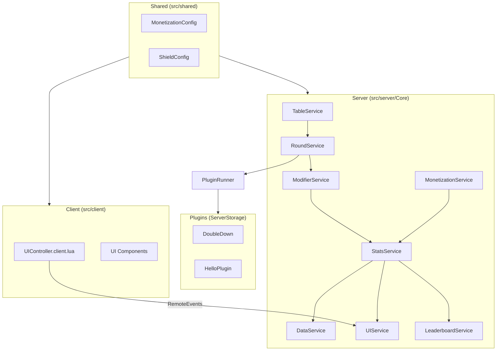

# TableGame1 Architecture

This document describes the architecture **as implemented in this repository**. It is intended for contributors and security reviewers.

## Project structure

```
TableGame1/
├── default.project.json    # Rojo project map
├── aftman.toml             # Toolchain (Rojo pin)
├── TableGame1.rbxl         # Studio place (world geometry, instances)
├── AGENTS.md               # Maintainer / AI agent conventions
├── ROADMAP.md              # Planned features (not all implemented)
└── src/
    ├── client/
    │   ├── init.client.luau
    │   └── UI/                 # Presentation layer
    ├── server/
    │   ├── init.server.luau    # Service bootstrap
    │   ├── Core/               # Authoritative services
    │   ├── Plugins/            # Minigame modules
    │   ├── Config/             # Server config modules
    │   └── Assets/             # Server-referenced assets (partial)
    └── shared/                 # Replicated config modules
```

### Rojo mapping

| Filesystem | Roblox |
|------------|--------|
| `src/shared` | `ReplicatedStorage.Shared` |
| `src/server` | `ServerScriptService.Server` |
| `src/server/Plugins` | `ServerStorage.Plugins` |
| `src/client` | `StarterPlayer.StarterPlayerScripts.Client` |

World content (map, leaderboard parts, table spawn hitboxes) primarily lives in `TableGame1.rbxl`, not in `src/`.

---

## Client / server / shared boundaries



### Rules (enforced by convention)

1. **`StatsService`** is the single authority for stats and inventory (Cash, Gems, Shields, streaks, etc.).
2. **UI never owns gameplay state** — it renders server snapshots and sends requests.
3. **Systems do not read or mutate each other's internal tables** — use public module APIs.
4. **Modifier logic** lives in `src/server/Core/Modifiers/`, applied by `ModifierService` before stat updates.
5. **Minigame rules** live in `Plugins/`, invoked by `PluginRunner` from `RoundService`.

---

## Server services

Boot order in `src/server/init.server.luau`:

1. `DataService.Init()`
2. `StatsService.Init()`
3. `MonetizationService.Init()`
4. `DevTestService.Init()` — **Studio only**
5. `LeaderboardService.Init()`
6. `TableService.Init()`
7. `TableService.OnTableReady` → `RoundService.HandleTableReady`

| Module | Responsibility |
|--------|----------------|
| `DebugService` | Structured logging levels and context |
| `DataService` | DataStore load/save, cache, autosave, schema sanitization |
| `StatsService` | In-memory player stats, round result application, inventory APIs |
| `MonetizationService` | Game passes, dev products, VIP cache, restore offers, receipts |
| `LeaderboardService` | OrderedDataStore reads/writes for in-world boards |
| `TableService` | Spawn tables, seat players, shield arming while waiting, `OnTableReady` |
| `RoundService` | Countdown, plugin run, cinematics sync, result payload, cleanup |
| `ModifierService` | Ordered modifier pipeline (currently `ShieldModifier`) |
| `UIService` | Creates `ReplicatedStorage.Remotes`, fires client events, handles `PromptResponse` |
| `PluginRegistry` / `PluginRunner` | Discover and run plugins from `ServerStorage.Plugins` |
| `SpinService` | Loot spin logic used by DoubleDown |
| `FXService` | Server-side effects hooks |
| `DevTestService` | Studio harness for synthetic rounds and monetization tests |

---

## Client UI

Primary entry: `src/client/UI/UIController.client.lua` (LocalScript).

Components under `src/client/UI/Components/`:

| Component | Purpose |
|-----------|---------|
| `StatsHUD` | Cash, gems, save indicator |
| `SeatUI` | Waiting-state shield / leave controls |
| `ShieldInventoryUI` | Shield count display |
| `ChoicePopup` | Split / Steal / DoubleDown prompts |
| `RestoreOfferMenu` | Post-loss restore purchase UI |
| `CountdownWidget` | Pre-match countdown |
| `Toast` | Notifications |
| `IntroGuideOverlay` / `IntroTableGuide` | Onboarding |
| `VIPPromoCard` | VIP promotion surface |

Supporting controllers: `CinematicController`, `PromptController`, `WorldSpinUIController`, `AnimatedBackgroundController`, `FxService`, `Theme`.

`src/client/init.client.luau` is a minimal boot stub; most client logic runs from `UIController.client.lua`.

---

## Shared configuration

| Module | Contents |
|--------|----------|
| `MonetizationConfig` | Game pass IDs, dev product IDs, VIP multiplier, shield/restore tunables |
| `ShieldConfig` | Compatibility shim pointing at monetization shield limits |
| `Hello.luau` | Placeholder shared module |

Product IDs in config are real Roblox asset IDs. VIP game pass ID is `0` in config (placeholder until configured for your experience).

---

## Data flow

### Round lifecycle

```
Player joins seat (TableService)
    → both seats filled → OnTableReady
    → RoundService: countdown → MatchStart
    → PluginRunner.Run("DoubleDown", context)
        → UIService prompts (PromptChoice / PromptResponse)
        → plugin returns resultPayload
    → ModifierService.ApplyRoundModifiers(context)
    → StatsService.ApplyRoundResult(...) per player
    → MonetizationService (restore offer if loser eligible)
    → UIService: MatchEnd, StatsUpdate, RestoreOfferState
    → TableService: reset seats
```

`resultPayload` carries outcome flags (`didDraw`, `didBothLose`, `isNeutral`, `winnerUserId`, `rewardCash`, etc.) consumed by stats and modifiers.

### Player state and persistence

```
PlayerAdded
    → DataService.LoadPlayer(userId)
    → StatsService binds loaded stats
    → UIService pushes StatsUpdate to client

Stat mutation (round, purchase, dev command)
    → StatsService updates in-memory stats
    → DataService.MarkDirty / SavePlayer (throttled)
    → UIService.StatsUpdate (and ShieldChanged when relevant)
    → LeaderboardService queues OrderedDataStore write (debounced)
```

DataStore name: `TableGame1_v1_DEV` or `TableGame1_v1_PROD` depending on `RunService:IsStudio()`.

### Purchases and monetization

```
Client purchase prompt (MarketplaceService or server PromptMonetizationProduct)
    → Roblox MarketplaceService
    → ProcessReceipt (MonetizationService)
        → route by product kind (Gems, Shields, Restore)
        → StatsService grant APIs
        → return PurchaseGranted / NotProcessedYet

Restore flow:
    → loser eligible after round → MonetizationService creates timed offer
    → UIService.RestoreOfferState → client RestoreOfferMenu
    → client RequestRestorePurchase → server validates expiry → prompt product
```

VIP ownership is cached server-side; cash rewards can be multiplied via `MonetizationConfig.VIP.CashRewardMultiplier`.

---

## Remotes

`UIService` creates a `ReplicatedStorage.Remotes` folder at runtime.

**Server → client (examples):** `PromptChoice`, `Notify`, `MatchStart`, `MatchEnd`, `StatsUpdate`, `ShieldChanged`, `RestoreOfferState`, `PlaySpinCinematic`, `MatchCountdown`.

**Client → server (examples):** `PromptResponse`, `UseShield`, `LeaveSeat`, `RequestRestorePurchase`, `CinematicStartedAck`, `CinematicStoppedAck`.

Only `PromptResponse` is wired in `UIService` at module load; other server handlers are connected in `TableService`, `RoundService`, or `MonetizationService`.

---

## Plugin system

Plugins are `ModuleScript` instances under `ServerStorage.Plugins` (filesystem: `src/server/Plugins/`).

Expected API:

```lua
-- Plugin module exports Run(context) -> resultPayload
function Plugin.Run(context)
    -- context includes players, UIService access, table model, etc.
    return resultPayload
end
```

Current plugins:

- **`DoubleDown`** — full 1v1 minigame with spin + two choice stages
- **`HelloPlugin`** — minimal example

---

## Test harness and dev utilities

### DevTestService (Studio only)

Initialized from `init.server.luau` when `RunService:IsStudio()`. Chat commands attached in the same file.

Harness capabilities (see [AGENTS.md](../AGENTS.md)):

- Stat snapshots: `/dumpstats`, `/dumpstats all`
- Monetization inspection: `/dumpmonetization`, `/setvip on|off`
- Synthetic receipts: `/testreceipt`, `/testrestore`
- Synthetic round outcomes: `/testround single_win_p1`, `draw`, `vip_single_win_p1`, etc.

Synthetic rivals use negative UserIds and stay harness-local.

### Legacy Studio chat commands

Also Studio-only via `init.server.luau`: `/cmds`, `/plugins`, `/run <plugin>`, `/shields`, `/gems`, `/shieldtest`.

---

## Areas needing future cleanup

Documented honestly — not blockers for open source, but worth tracking:

| Area | Notes |
|------|-------|
| **Split client entry** | `init.client.luau` is minimal; `UIController.client.lua` holds most client boot logic |
| **World vs source split** | Map, hitboxes, and leaderboard instances are in `.rbxl`, not fully represented in Rojo tree |
| **Partial Assets path** | Only `CamRig2.lua` under `src/server/Assets/`; table template model lives in place/ServerStorage |
| **ROADMAP vs code** | [ROADMAP.md](../ROADMAP.md) lists shop, idle, and emote systems not yet in `src/` |
| **VIP game pass ID** | `MonetizationConfig.GamePasses.VIP.Id = 0` — must be set for production VIP |
| **No CI lint/test** | Validation is manual Studio + harness today |
| **Internal docs in repo root** | Files like `TABLEGAME1_SOURCE_OF_TRUTH_V7.md` are maintainer notes, not contributor-facing |

---

## Related files

- [README.md](../README.md) — setup and overview
- [CONTRIBUTING.md](../CONTRIBUTING.md) — contribution workflow
- [SECURITY.md](../SECURITY.md) — vulnerability reporting
- [AGENTS.md](../AGENTS.md) — harness rules and architecture constraints
